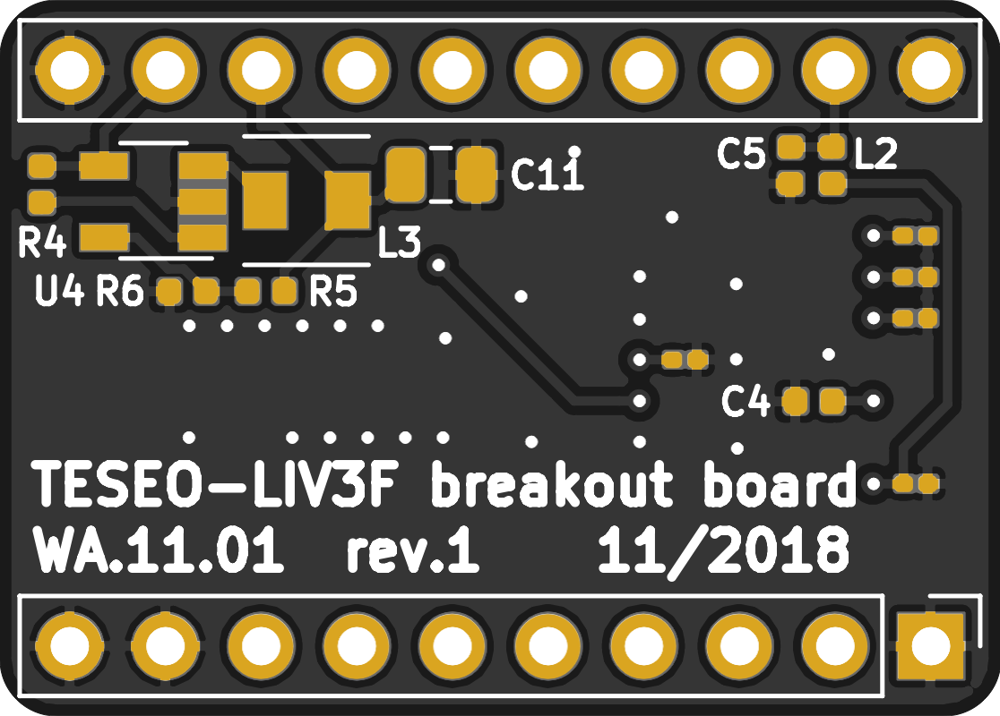

# Teseo-LIV3F Breakout Board

### Project Status

### Overview

This repo represents a [Teseo-LIV3F](https://www.st.com/en/positioning/teseo-liv3f.html) tiny GNSS Module  breakout board, purposed to check around and play with the module itself.

### Features

## Schematic

_schematic_  

The schematic includes the module itself, as well as LNA
- BGA725L6 is used as LNA. The LNA provides 20.0 dB gain and 0.65 dB noise
figure at a current consumption of 3.6 mA. Next TDK's BGFor filtering the output signal from the amplifier a SAW RF filter
- the bypassing circuit is added
- blocking capacitors
- battery

## PCB design

The PCB is designed as standard 2 layers module. The LNA, SAW filter and GNSS module and most of the RF components are placed on the top side of the PCB. The power supply converter and the filtering capacitors are placed on thee bottom side of the PCB. By the bypassing circuit (R2, R3) the input signal could be routed directly to the input of the GNSS module so the mounting of the LNA and the SAW filer could be skipped. The PCB is designed as a breadboard friendly module.

_top side_  

_bottom side_  

## BOM

You can find the list of components

| id | name       | value             | description                   | quantity | use      | datasheet        | supplier |
|----|------------|-------------------|-------------------------------|----------|----------|------------------|----------|
| 1  | C1, C3     | 120pF             | Capacitor SMD 0402            | 2        |          | link             |          |
| 2  | C2         | 1nF               | Capacitor SMD 0402            | 1        |          | link             |          |
| 3  | C4, C5     | 10nF              | Capacitor SMD 0402            | 2        |          | link             |          |
| 4  | C6 ... C10 | 56pF              | Capacitor SMD 0201            | 5        | optional | link             |          |
| 5  | C11        | 22uF              | Capacitor SMD 0805            | 1        |          | link             |          |
| 6  | J1         | Hirose U.FL-R-SMT | Connector Coaxial SMT         | 1        |          | [link][547904e4] | link     |
| 7  | J2, J2     | Pin Header 1x10   | Connector                     | 2        |          |                  |          |
| 8  | L1         | 5.6nH             | Indictor SMD 0402             | 1        |          |                  |          |
| 9  | L2         | 27nH              | Indictor SMD 0402             | 1        |          |                  |          |
| 10 | L3         | 10uH              | Indictor SRP3020TA-100M       | 1        |          | [link][a173d720] |          |
| 11 | R1         | 10k               | Resistor SMD 0402             | 1        |          |                  |          |
| 12 | R2, R3     | 0R                | Resistor SMD 0402             | 2        | optional |                  |          |
| 13 | R4         | 1M                | Resistor SMD 0402             | 1        |          |                  |          |
| 14 | R5         | 68k               | Resistor SMD 0402             | 1        |          |                  |          |
| 15 | R6         | 15k               | Resistor SMD 0402             | 1        |          |                  |          |
| 16 | U1         | BGA725L6          | Low Noise Amplifier           | 1        |          | [link][91a703e9] |          |
| 17 | U2         | B4327             | SAW RF Filter                 | 1        |          | [link][4e494875] |          |
| 18 | U3         | TESEO-LIV3F       | Tiny GNSS module              | 1        |          | [link][32717b5e] |          |
| 19 | U4         | ST1S12GR          | Step-Down Switching Regulator | 1        |          | [link][62466740] |          |

  [62466740]: https://www.st.com/resource/en/datasheet/st1s12xx.pdf "ST1S12GR"
  [32717b5e]: https://www.st.com/resource/en/datasheet/teseo-liv3f.pdf "TESEO-LIV3F"
  [a173d720]: https://www.bourns.com/docs/Product-Datasheets/SRP3020TA.pdf "STP3020AT"
  [91a703e9]: https://www.infineon.com/dgdl/Infineon-BGA725L6-DS-v02_00-en.pdf?fileId=db3a30433784a0400137ef9a4d341f23 "BGA727L6"
  [4e494875]: https://en.rf360jv.com/inf/40/ds/ae/B4327.pdf "SAW RF Filter"
  [547904e4]: https://www.hirose.com/product/en/products/U.FL/U.FL-R-SMT-1%2810%29/ "U.Fl"

## Ordering

- not tested yet
- the PCB can be ordered from [PCBs.io](https://PCBs.io/share/zal7j).

## License

This work is licensed under a [Creative Commons Attribution-Non Commercial 4.0 International License](http://creativecommons.org/licenses/by-nc/4.0/)
If you want to do commercial stuff with this project, please [contact me](http://www.senecca.nl) so we can organize an simple agreement.
